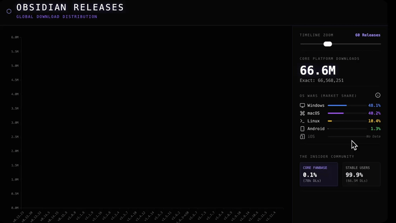
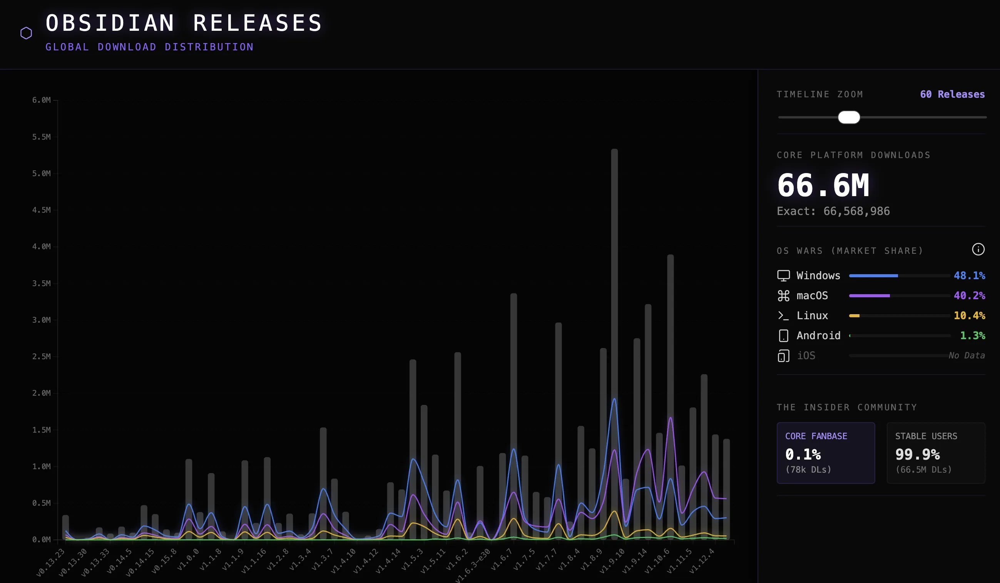

  
  
  <h1 align="center">OBSIDIAN DOWNLOAD STATS</h1>
  <h3 align="center"> D3.js Obsidian Releases Telemetry Visualizer </h3>

  <!-- TOP PURPLE LINKS -->
  
  
  
   
  <!-- BOTTOM GOLD TAXONOMY -->
  
  
  
  

  

    <i> An interactive D3.js visualization mapping Obsidian releases download stats. Includes real-time timeline zoom, OS market share charts, stable vs insider breakdown, and fluid canvas animations. </i>
  

  

Welcome to **Obsidian Download Stats**, an interactive telemetry dashboard that fetches and visualizes release download statistics directly from the GitHub API. Rendered inside Obsidian using a custom D3.js chart engine, this component maps historical download curves, Windows/Mac/Linux OS distribution trends, and community release adoption.

---

## Quick Start

To start trying Obsidian Download Stats today:
1. **Download the Repository**: Clone or download this repository directly into any folder inside your Obsidian vault.
2. **Install Datacore**: Ensure you have the **Datacore** plugin installed and enabled in Obsidian.
3. **Open the Entry Note**: Open the **`OBSIDIAN DOWNLOAD STATS.md`** note inside Obsidian to launch the component!

---

## Features

### Interactive D3.js Visualizations
*   **Release Distribution Curves**: Renders clean bar charts representing downloads per version.
*   **Interactive Tooltips**: Hover over bars to view version details, publish dates, and exact OS-specific telemetry.
*   **Timeline Slider Zoom**: Smoothly scale the visible timeline range to focus on recent or historical releases.
*   **Responsive Resize**: Debounced resize handlers automatically scale the D3 SVG viewport on pane adjust.

### Telemetry Breakdown
*   **OS Market Share**: Tracks distribution wars (Windows vs macOS vs Linux) using clean progress bar visualizers.
*   **Insider Community Stats**: Outlines stable vs insider fanbase ratios.
*   **Real-time GitHub Telemetry**: Automatically paginates through GitHub Release API payloads.

### Immersive Portal Mode
*   **Full Tab Reparenting**: Collapses Obsidian view status bars and reparents the node edge-to-edge for zero-distraction viewing.

---

## Directory Index & Components

The package exposes the following compiled files:

| File | Description |
| :--- | :--- |
| **[OBSIDIAN DOWNLOAD STATS.md](OBSIDIAN%20DOWNLOAD%20STATS.md)** | Main entry point leaf designed to load inside Obsidian. |
| **[src/index.jsx](src/index.jsx)** | Main bootstrap application loader and polling invalidation daemon. |
| **[src/components/MainComponent.jsx](src/components/MainComponent.jsx)** | The core D3 visualizer rendering charts and parsing APIs. |
| **[src/styles/styles.jsx](src/styles/styles.jsx)** | Layout styling properties. |
| **[src/utils/LoadScriptUpgrade.js](src/utils/LoadScriptUpgrade.js)** | Self-contained ESM script loader with caching. |
| **[data/mcp_commands.json](data/mcp_commands.json)** | Hot reload polling configuration. |
| **[METADATA.md](METADATA.md)** | Manifest manifest detailing component index taxonomy. |
| **[CONTRIBUTION.md](CONTRIBUTION.md)** | Coding standards. |
| **[LICENSE.md](LICENSE.md)** | Licensing terms. |

---

## Previews

| Static View | Interactive Graph Explorer |
| :---: | :---: |
|  |  |

---

## Attribution
*   The data visualization is built on top of the [D3.js](https://d3js.org/) library.
*   Telemetry data is fetched dynamically from the official [Obsidian Releases Repository](https://github.com/obsidianmd/obsidian-releases).

---

## Contributors
- beto.group
